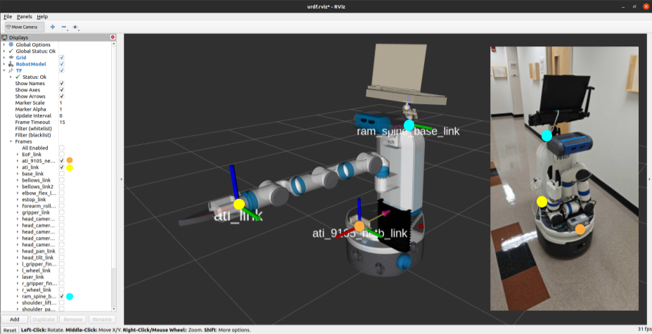
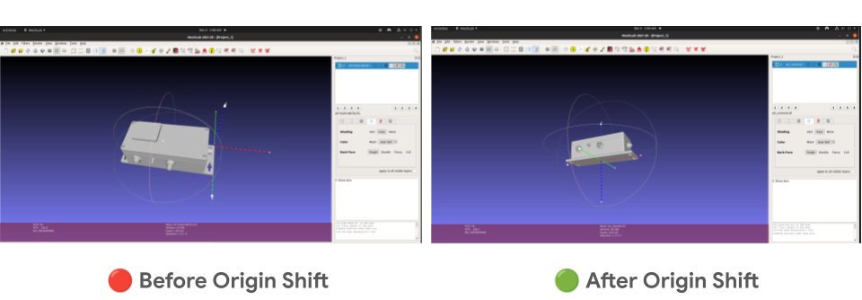

# 🚀 Overview

- This repository is dedicated to the **3D modeling of the Fetch robot** for use in the IRVL lab.  
- For sensor-related configurations, ROS packages, and scripts, refer to the [fetch_ros_IRVL repository](https://github.com/IRVLUTD/fetch_ros_IRVL) which is included as a submodule here to allow seamless integration with the 3D models.
---




# ⚙️ Setup
Follow these simple steps to set up the repository and integrate the 3D models with your environment.
### Step 1️⃣: Clone the Repository
```shell
git clone --recurse-submodules https://github.com/IRVLUTD/irvl-fetch-3d-model
cd irvl-fetch-3d-model
```

### Step 2️⃣: Add 3D Models to the Appropriate Folders
Make sure the required files are placed in the correct directories:

- Meshes
  - Copy the following STL files to [`src/fetch_ros_IRVL/fetch_description/meshes`](src/fetch_ros_IRVL/fetch_description/meshes)
    - [3DModels/ATI-9105-NETB.stl](3DModels/ATI-9105-NETB.stl)
    - [3DModels/fetch_ram_spine_with_mount_and_legion_laptop.stl](3DModels/fetch_ram_spine_with_mount_and_legion_laptop.stl)
- URDFs
  - Move all .urdf files from [`urdf/`](./urdf) to [src/fetch_ros_IRVL/fetch_description/robots](src/fetch_ros_IRVL/fetch_description/robots)
    - add a symlink from the desired .urdf to fetch.urdf within the same dir
    - `fetch.urdf` will be read for display purposes

### Step-3️⃣: 🌟 Reference for Visualizing URDF with TF Frames

To visualize the updated URDF with TF frames, **Problem 2** from the following reference has been referred:  
- [📄 CS 6301 Homework 1 (Fall 2024)](https://yuxng.github.io/Courses/CS6301Fall2024/CS_6301_Homework_1_Fall_2024.pdf)  
- [🔗 Course Homepage](https://labs.utdallas.edu/irvl/courses/fall-2024-cs-6301/)  
- Once you have the `urdf_tutorial/launch/display_fetch.launch` ready

```shell
# rm if any exists
rm -rf build/ devel/;

# 
catkin_make; source  devel/setup.bash;

# launch the display_fetch.launch
roslaunch urdf_tutorial display_fetch.launch
```

https://github.com/user-attachments/assets/ec48406e-708b-45ea-bcaf-88e913b426d8

# 🛠️ Model Modifications
### ✏️ Adjusting Model Origin (ATI NetB)
The ATI NetB model’s origin has been shifted to its 2D centroid (ignoring height) for better alignment.
Before and After:



To shift the origin of the ATI NetB model from one end to the 2D centroid (ignoring height), use the following Python script with `trimesh`:

```python
import trimesh

# Load the STL file
mesh = trimesh.load("path_to_your_input_file.stl")

# Get the centroid and create a writable copy
centroid = mesh.centroid.copy()

# Set the Z-coordinate of the centroid to 0
centroid[2] = 0.0

# Translate the mesh to align with the modified centroid
mesh.apply_translation(-centroid)

# Export the updated STL file
mesh.export("path_to_your_output_file.stl")
```

### 💻 Laptop with Mount
- The laptop mount was designed using the following components:
  - 2 x [`ram round plates with ball`](3DModels/parts/ram-mount-round-plate-with-ball/Ram%20Mount.stl)
  - 1 x [`ram spine`](3DModels/parts/RAM-201U-B-spine/ram-201u-b-spine.stl)
  - 1 x [`tray for holding the laptop`](3DModels/parts/ram_tray_based_on_laptop.stl) created using [this script](scripts/create_ram_tough_tray_stl_based_on_legion.py).
  - 1 x [`lenovo legion latop 7`](3DModels/parts/legion_centroid.stl)
- All the previous parts have been assembled to match the shape and pose of the real laptop mount in the fetch robot at IRVL.
All parts have been assembled in the [Blender](blender/fetch_ram_mount_with_legion.blend) file to replicate the real-world setup of the Fetch robot.

https://github.com/user-attachments/assets/48ac7f68-7e27-4822-a902-edcf329452a4

# 📦 Model Sources

- **RAM Mount**: The RAM mount model was obtained from [GrabCAD](https://grabcad.com/library/ram-102u-b-2461-ram-mounts-1).  
- **Lenovo Legion Laptop**:  
  - Primary model: [GrabCAD](https://grabcad.com/library/lenovo-legion-laptop-1).  
  - Alternative model: [3D Warehouse](https://3dwarehouse.sketchup.com/model/95491b39-f3bf-48d7-a95e-672f4af7d85a/Lenovo-Legion-7). [Adhere to the license] 
- **9105-NETB**: This model was sourced from [3D Content Central](https://www.3dcontentcentral.com/Model-Preview-Resp.aspx?catalogId=201&id=1239590).  

---

# 🛠️ Tools and Software used for making this

1. **FreeCAD Installation**:  
   Install FreeCAD for handling 3D models with the command:  
   ```bash
   sudo apt-get install freecad
   ```

2. **File Conversion Tools**:  
   - **[ImageToSTL](https://imagetostl.com)**:  
     - Convert `.stp` files to `.stl`.  
     - Convert `.dae` files (e.g., laptop models) to `.stl`.  
     - ⚠️ *Note*: The tool may fail for some file types.  

   - **[3DEncoder](https://3dencoder.com)**:  
     - Convert `.SKP` or `.model` files to `.stl`.  
     - 🆓 Free users can only convert **3 files per day** and upload files up to **20 MB**. Paid users get increased quotas and file size limits.

---

# 📜 License
- This project is MIT licensed.
- But the 3D models used have their own license.
- Before using this project, please read the respective license files.
